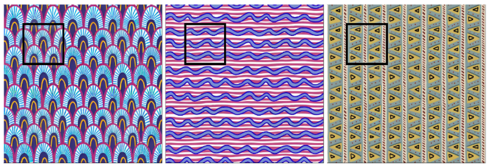

# Structured Pattern Expansion via Diffusion Models

This repository contains the official implemetation for **Structured Pattern Expansion via Diffusion Models**.



### Abstract
Recent advances in diffusion models have significantly improved the synthesis of materials, textures, and 3D shapes. By conditioning these models on text or images, users can guide the generation, reducing the time required to create digital assets. In this paper, we address the synthesis of structured, stationary patterns, where diffusion models are generally less reliable and, more importantly, less controllable. Our approach leverages the generative capabilities of diffusion models specifically adapted to the pattern domain. It enables users to exercise direct control over the synthesis by expanding a partially hand-drawn pattern into a larger design while preserving the structure and details of the input. To enhance pattern quality, we fine-tune an image-pretrained diffusion model on structured patterns using Low-Rank Adaptation (LoRA), apply a noise rolling technique to ensure tileability, and utilize a patch-based approach to facilitate the generation of large-scale assets. We demonstrate the effectiveness of our method through a comprehensive set of experiments, showing that it outperforms existing models in generating diverse, consistent patterns that respond directly to user input.

## Overview 

## Getting Started

**1. Clone the repo**
 
```shell
git clone https://github.com/marzia-riso/structured-pattern-expansion.git
cd structured-pattern-expansion
```

**2. Setting up the environment**

The repo is tested under `python 3.10`. Possible conflicts may arise if a different python version is used.

The environment information is contained in the `.yml' file. To set up the environment run the following commands:
```shell
conda env create --name pex-env --file=pex-env.yml
conda activate pex-env
```

**3. Repository structure**

- **`src/`**: Python implementation (entrypoint in `src/main.py`).
- **`resources/`**: input assets (patterns/masks) and model weights. 

Model weights need to be downloaded separately from [this link](https://drive.google.com/drive/folders/1K6LYKQKlFzno4E3J0Yahwz0Mn_QX0VkG?usp=sharing) and copied under the resouces folder. If you encounter any issue in the downloads, please contact us through GitHub issues or authors' emails.

### Running expansion
Once the environment has been correclty set up, you can start an expansion process by running this command.

```shell
python src/main.py -i <INPUT_IMAGE_OR_FOLDER> -o <OUTPUT_DIR> -n <NUM_IMAGES> -f <EXPANSION_FACTOR> 
```

where:
- **`INPUT_IMAGE_OR_FOLDER`** can be a single file or a folder containing png images.
- **`OUTPUT_DIR`** (optional) is an output folder directory. If not entered, a default one will be created
- **`NUM_IMAGES`** (optional) is the number of expanded images created for each input image
- **`EXPANSION_FACTOR`** (optional) is the expansion factor for the generated images

## Citation
For more details please check out full paper [here](https://diglib.eg.org/items/13cdbf81-d51d-4f70-abd6-ae96bd9d79d3). 

```bibtex
@inproceedings{riso2025patternexpansion,
booktitle = {Smart Tools and Applications in Graphics - Eurographics Italian Chapter Conference},
title = {{Structured Pattern Expansion with Diffusion Models}},
author = {Riso, Marzia and Vecchio, Giuseppe and Pellacini, Fabio},
year = {2025},
publisher = {The Eurographics Association},
ISSN = {2617-4855},
ISBN = {978-3-03868-296-7},
DOI = {10.2312/stag.20251330}
}
```
